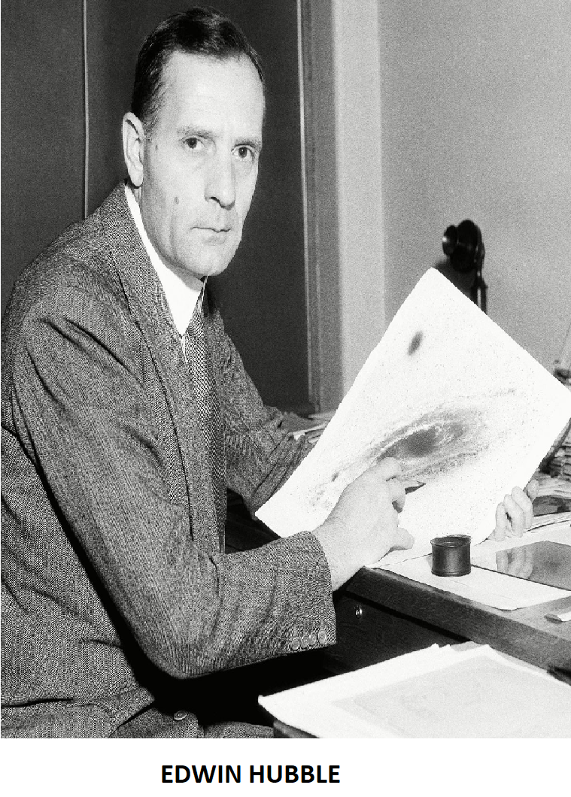
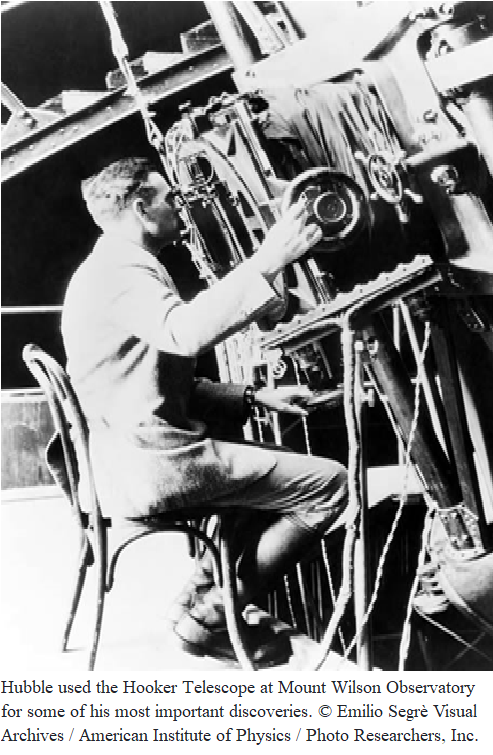
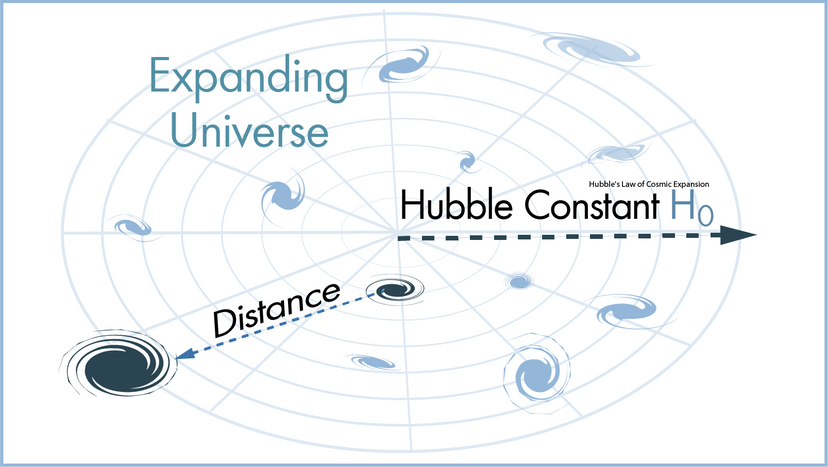
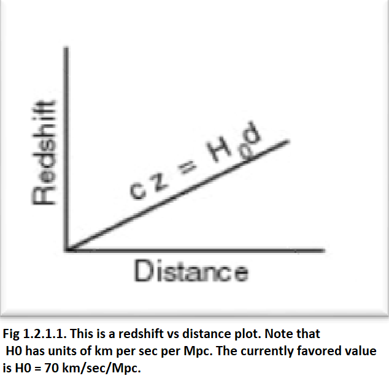
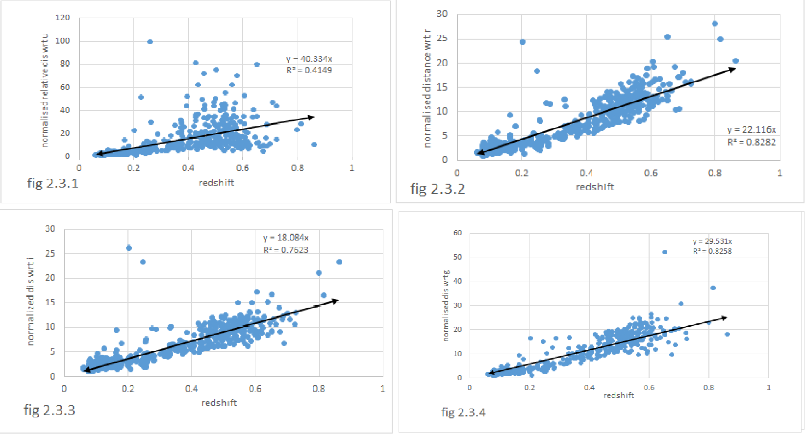
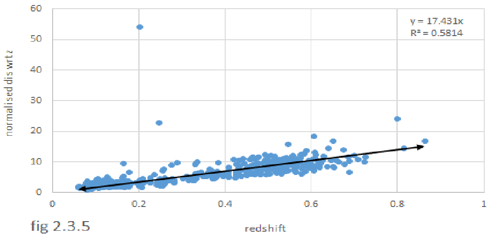

# STUDY-ON-HUBBLE-DIAGRAM-OF-GALAXIES

    
    

This repository contains the work done as part of my 4th semester M.Sc. project under the guidance of Prof. Tanuka Chattopadhyay, Department of Applied Mathematics. The project explores the Hubble diagram of galaxies, with the aim of deepening our understanding of the universe's expansion by analyzing the relationship between galaxy distances and their recessional velocities.

## Project Overview
In this project, I retrace the steps of Edwin Hubble to recreate his groundbreaking discovery of the expanding universe. By examining galaxies from the SkyServer database, I measure their magnitudes to estimate their distances. Using these distances along with the galaxies' redshifts, I construct a Hubble diagram, similar to what Hubble originally did. Additionally, I explore how astronomers calculate distances to galaxies and how to determine redshifts independently.

    

* **Objective:** The main objective of this project is to determine the value of 1/H₀ (where H₀ is Hubble's constant) for the collection of galaxies.

## Process
### 1. Data Collection
Extensive data was gathered from the SDSS_DR-16 database using SQL and the SkyServer database. This data includes five color magnitudes and redshifts of galaxies.

* SDSS_DR_16 DataBase: https://skyserver.sdss.org/dr16/en/tools/search/sql.aspx
* Code: SQLSearch.sql

### 2. Data Analysis

    

The relative distances of galaxies were calculated and plotted against redshift to create the final Hubble diagram. This process follows the equation:

                                                     𝑣 = H₀ × 𝐷
**where:**
   - \( v \) is the recessional velocity,
   - \( H₀ \) is Hubble's constant,
   - \( D \) is the distance

## Result

    
    

## Repository Contents
- /Data: Contains the raw data from the SDSS_DR-16 databases.
- /Result: The final plots and processed data.
- /image: Used images other than plots.
- SQLSearch.sql: SQL scripts used for data collection.
  
## Acknowledgments
- Prof. Tanuka Chattopadhyay, Department of Applied Mathematics, for guidance and support throughout this project.

## References

- **SDSS DR16:** http://skyserver.sdss.org/dr16/en/home.aspx
- **Hubble's Law on Wikipedia:** https://en.wikipedia.org/wiki/Hubble%27s_law
- **Hubble’s Law and the expanding universe:** https://www.pnas.org/content/112/11/3173
- **Galaxy information and facts:** https://www.nationalgeographic.com/science/article/galaxies
- **The Age of the Universe:** https://www.e-education.psu.edu/astro801/content/l10_p5.html
- **Hubble’s diagram:** https://quarknet.fnal.gov/fnal-uc/eeu/hubblediagram
- **Hubble’s law:** https://astronomy.swin.edu.au/cosmos/h/Hubble+Law
- GRAVITATION AND COSMOLOGY Principles And Applications Of The General Theory Of Relativity By STEVEN WEINBERG
- AN INTRODUCTION TO RELATIVITY BY JAYANT V. NARLIKAR, Chapter 14 “The expanding universe”
